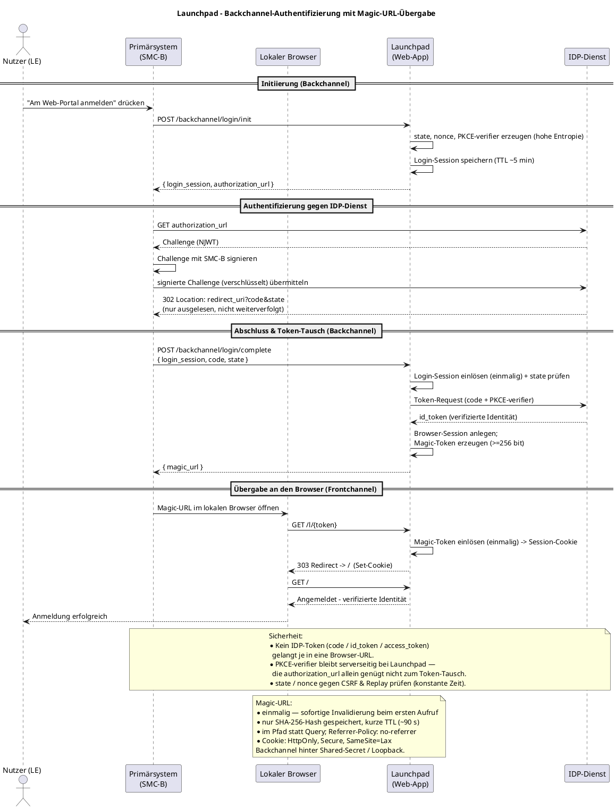

# zero-launchpad — SMC-B backchannel auth with magic-URL browser handoff

## Context

We want a web app that a user logs into **in their local browser** without ever typing a
password or handling a smartcard in the browser. The card-bound authentication is performed by
the **Primärsystem** (the practice's thick client, which holds the SMC-B) against the gematik
**IDP-Dienst**, and the resulting authenticated identity is *launched* into a local browser
session via a **one-time "magic URL"**. No IDP token (`code`, `id_token`, `access_token`) ever
rides in a browser URL — only a single-use handoff token does.

This mirrors the gematik NCPeH `auth_seq-alternative4c` pattern (backchannel proves possession,
frontchannel redeems a nonce for a session) but replaces the bespoke "sign a proxy nonce" step
with a **real gematik IDP-Dienst OAuth2/PKCE authorization**, exactly the flow the FHIR-VZD
`owner_authenticate_softcert.py` sample and this repo's `epa` package already perform.

Name chosen: **Launchpad** — the app is the pad from which an authenticated browser session is
launched. New workspace module `github.com/gematik/zero-lab/go/launchpad`, binary
`zero-launchpad`, docker image `zero-launchpad`.

Decisions locked with the user: **soft-cert (SMC-B PKCS#12) only** for this iteration;
**minimal bespoke JSON backchannel** toward the Primärsystem (the standards-grade OAuth2/PKCE
is toward the IDP-Dienst); ship **the web app *and* a runnable PS demo client**.

## The protocol

```
User        Primärsystem (SMC-B)            Launchpad (web app)              IDP-Dienst        Local browser
 │  click "log in"  │                              │                               │                │
 │─────────────────►│                              │                               │                │
 │                  │  POST /backchannel/login/init│                               │                │
 │                  │─────────────────────────────►│ gen state,nonce,verifier      │                │
 │                  │                              │ store login:<id> (TTL 5m)     │                │
 │                  │  {login_session, auth_url}   │ auth_url via gemidp.Client    │                │
 │                  │◄─────────────────────────────│   .AuthenticationURL()        │                │
 │                  │  GET auth_url (no-follow) ───────────────────────────────────►│ challenge NJWT │
 │                  │  sign challenge w/ SMC-B (SignWithSoftkey), POST signed ──────►│                │
 │                  │  302 Location: redirect_uri?code&state  (read, NOT followed) ◄─│                │
 │                  │  POST /backchannel/login/complete                             │                │
 │                  │  {login_session, code, state}│                               │                │
 │                  │─────────────────────────────►│ Take(login:<id>) single-use   │                │
 │                  │                              │ verify state (const-time)     │                │
 │                  │                              │ ExchangeForIdentity(code,verif)──────►│ id_token│
 │                  │                              │ create sess:<id> + identity   │                │
 │                  │                              │ MagicStore.Create → raw token │                │
 │                  │        {magic_url}           │ store magic:<sha256> (TTL 90s)│                │
 │                  │◄─────────────────────────────│                               │                │
 │                  │  open magic_url in browser ───────────────────────────────────────────────────►│
 │                  │                              │ GET /l/<token>                │                │
 │                  │                              │ MagicStore.Redeem = Take(hash)│  set cookie    │
 │                  │                              │ 303 → /                       │───────────────►│
 │  logged in, sees identity ◄─────────────────────────────────────────────────────────────────────│
```

A schematic PlantUML rendering of this flow ships as **`launchpad/docs/auth_seq.puml`**, in the
style of the gematik `auth_seq-alternative4c.puml` reference (challenge signing abstracted to a
single "sign with SMC-B" step; essential security considerations inline). Full content:



Why this is safe: the **verifier** (PKCE pre-image) is held only server-side by Launchpad, so
even a party that observes `auth_url` cannot complete the token exchange. The **code** is seen
only by the PS (over the backchannel) and exchanged server-side. The only secret that touches
the browser is the **magic token**, which is single-use, hashed at rest, short-TTL, and carries
no identity by itself.

## Reused components (verified — file:line)

- `gemidp.NewClientFromConfig(ClientConfig{Environment, ClientID, RedirectURI, Scopes, UserAgent})`
  — `gemidp/client.go:75`. Requires ClientID, RedirectURI, ≥1 Scope.
- `(*gemidp.Client).AuthenticationURL(state, nonce, verifier, …)` direct S256 PKCE — `gemidp/client.go:125,140`.
- `(*gemidp.Client).ExchangeForIdentity(code, verifier, …) (*oidc.TokenResponse, error)` — `gemidp/client.go:181`.
- `gemidp.NewAuthenticator` + `(*Authenticator).Authenticate(authURL) (*CodeRedirectURL{URL,Code,State}, error)`
  — `gemidp/authenticator.go:107`. **Confirmed**: derives a redirect-suppressing client and reads
  `resp.Location()` from the 302 (`authenticator.go:122-126,228-237`) — the `redirect_uri` is never
  served, so Launchpad needs no OAuth callback route (only registration of the `client_id`/`redirect_uri`
  pair at the IDP).
- `gemidp.SignWithSoftkey(prk, cert)` — `gemidp/authenticator.go:286`. Soft-cert signer.
- `gemidp.GetIdpByEnvironment`, `Environment`, `NewEnvironment` — `gemidp/shared.go`.
- `oidc.TokenResponse.Claims(&x)` — `oauth/oidc/oidc.go:47` (used the same way in `pep/proxy/backend_provider.go:151`).
- `kv.Store` with **atomic `Take` (get+delete)** and atomic `SetMany` — `kv/kv.go:56-60` (documented for
  single-use redeem). `kv.NewMemory()` for single-instance dev.
- SMC-B p12 load: `pkcs12.Decode` + `brainpool.ParsePKCS8PrivateKey`/`ParseCertificate` (pattern in
  `ti/internal/epa/epa_auth_p12.go:41-62`), or `epa.LoadIdentityP12` (`epa/identity.go:19`) which already
  selects the C.AUT cert.
- Server/UI: Echo + `middleware.Recover()` + embedded templates/static — pattern from
  `epa/cmd/zero-epa/cmd/proxy.go:53` and `epa/portal/portal.go` (`//go:embed`, `template.ParseFS`, `fs.Sub`).
- Docker: `epa/cmd/zero-epa/Dockerfile` (golang:1.26 → scratch, CGO_ENABLED=0, non-root).
- Session-store-with-hashed-single-use-secret shape: `pdp/authzserver/session_store_kv.go`.

## New module layout — `launchpad/`

```
launchpad/
  go.mod  go.sum  version.go          # module + ResolveVersion (copy epa/version.go)
  config.go                           # IDP env/client_id/redirect_uri/scopes/user_agent; addr; cookie flags; TTLs; backchannel shared secret
  server.go                           # Server{ *gemidp.Client, kv.Store, MagicStore, sessions }, Echo router
  idp.go                              # buildIDPClient(cfg) via gemidp.NewClientFromConfig
  loginsession.go                     # LoginSession{ID,State,Nonce,Verifier,Env,CreatedAt}, kv "login:" (TTL ~5m), Take on complete
  magic.go                            # MagicStore over kv "magic:" — Create/Redeem, sha256 hash, Take, TTL 90s
  browsersession.go                   # BrowserSession{ID,Identity}, kv "sess:" (TTL ~8h); cookie set/read/clear
  identity.go                         # Identity + FromClaims(map) → idNummer, professionOID, organizationName, display_name
  backchannel.go                      # PS-facing handlers: init, complete
  browser.go                          # browser handlers: redeem (/l/:token), home (/), logout
  docs/auth_seq.puml                  # schematic sequence diagram (gematik style)
  templates/  (embed.FS)              # layout.html, pages/{index,login,error}.html, static/app.css
  cmd/zero-launchpad/
    main.go                           # → cmd.Execute()  (copy epa/cmd/zero-epa/main.go)
    cmd/{root.go, serve.go, client.go, version.go}
    Dockerfile                        # copy epa Dockerfile; CMD ["/app/zero-launchpad","serve"]
  zero-launchpad.yaml                 # sample config
```

## HTTP endpoints

**Backchannel (Primärsystem-facing JSON)** — put behind a config shared-secret bearer and/or bind to loopback.

| Method / path | Request | Response | Key calls |
|---|---|---|---|
| `POST /backchannel/login/init` | `{}` (opt `{"environment":"ref"}`) | `{"login_session","authorization_url"}` | `oauth2.GenerateVerifier()`, `ksuid.New()`, `AuthenticationURL(state,nonce,verifier)`, `SetMany(login:<id>)` |
| `POST /backchannel/login/complete` | `{"login_session","code","state"}` | `{"magic_url"}` | `Take(login:<id>)`, const-time state compare, `ExchangeForIdentity(code,verifier)`, `Claims`, create `sess:<id>`, `MagicStore.Create` |

Errors as `{"error","error_description"}` (reuse `oidc.Error` shape, `oauth/oidc/oidc.go:12`).

**Browser-facing**

| Method / path | Behavior |
|---|---|
| `GET /l/:token` | `MagicStore.Redeem` (atomic `Take`); set `launchpad_session` cookie; `Referrer-Policy: no-referrer`; **303 → /**. Failure → `error.html`. |
| `GET /` | valid session → `index.html` with verified identity; else `login.html` ("waiting for Primärsystem"). |
| `GET /logout` | delete `sess:<id>`, clear cookie, → `/`. |
| `GET /static/*`, `GET /healthz` | embedded assets; liveness. |

## PS demo client — `zero-launchpad client login`

Self-contained subcommand (`cmd/zero-launchpad/cmd/client.go`), no `ti` dependency:
1. Load SMC-B p12 → `gemidp.SignWithSoftkey(prk, cert)`.
2. `POST /backchannel/login/init` → `authorization_url`.
3. **Validate the returned `authorization_url` before signing anything** (see below) — abort on any mismatch.
4. `gemidp.NewAuthenticator(...)` + `Authenticate(authorization_url)` → `{Code, State}`.
5. `POST /backchannel/login/complete` → `magic_url`.
6. Open it via `github.com/pkg/browser` / `open` / `xdg-open`.

Flags: `--backchannel`, `--p12`, `--p12-password`, `--env`, `--backchannel-secret`,
`--allowed-scope` (repeatable), `--expected-client-id` (optional).

### Client-side scope confinement (rogue-Launchpad defense)

The PS holds the credential, so it — not Launchpad — must decide what the SMC-B signature
authorizes. A rogue or compromised Launchpad could return an `authorization_url` carrying a
**foreign or broadened `scope`** (or a different `client_id`, or a fake authorization endpoint),
and a naive client that blindly hands it to the Authenticator would make the card holder
cryptographically authorize it — a classic confused-deputy escalation.

`validateAuthorizationURL(raw, expected)` runs in step 3, **before** `Authenticate`, and aborts unless:

- `url.Parse` succeeds and `scheme == https`.
- The **host is the genuine IDP-Dienst** for the selected `--env`
  (`gemidp.GetIdpByEnvironment(env)` authorization endpoint host) — not an attacker-controlled host.
- `response_type == code` and `code_challenge_method == S256` (no downgrade).
- **`scope ⊆ --allowed-scope`**: split the URL's `scope` on spaces; every requested scope must be in
  the PS-side allowlist. Any extra/foreign scope ⇒ reject. (Empty allowlist ⇒ reject, fail-closed.)
- If `--expected-client-id` is set, `client_id` must equal it.

Only a URL that passes every check is signed. This keeps scope authority on the credential-holding
side and makes the Launchpad unable to widen what the card attests to.

## Workspace wiring

- **Git**: start on a fresh branch off `main` (e.g. `feat/launchpad`) before any changes — do not commit to `main`.
- `go.work`: add `./launchpad` to `use (...)`.
- `launchpad/go.mod`: `go 1.26.x`; require sibling `gemidp`, `oauth`, `kv` + `echo/v4`, `cobra`, `viper`,
  `ksuid`, `golang.org/x/oauth2`, `github.com/pkg/browser` (versions matching `pdp/go.mod`). Run `go mod tidy` in the module.
- **`Dockerfile`** (`launchpad/cmd/zero-launchpad/Dockerfile`): copy `epa/cmd/zero-epa/Dockerfile` verbatim,
  swap `epa`→`launchpad` paths and the `-X …/launchpad.Version` ldflag; `CMD ["/app/zero-launchpad","serve"]`.
- **`Justfile`** (root): add these targets, copied from the `*-epa` recipes:
  - `build-launchpad` (ldflags `-X github.com/gematik/zero-lab/go/launchpad.Version=$(just _modver launchpad)`),
    and add `launchpad` to the aggregate `build:` target.
  - `docker-build-launchpad` (builds `spilikin/zero-launchpad` via the Dockerfile above).
  - `docker-push-launchpad`.
  - Per-module release tag convention `go/launchpad/vX.Y.Z`.

## Correctness & security (must-hold)

- **Verifier reuse**: the *same* verifier string flows into `AuthenticationURL` and `ExchangeForIdentity`; store with the login session, never regenerate.
- **State**: const-time compare stored vs returned `state` before exchange (`crypto/subtle`). **Nonce**: persist it; the id_token carries `nonce` (`gemidp/client.go`), keep it for verification.
- **Single-use via `Take`** (never Get-then-Delete) for both `login:<id>` and `magic:<hash>` — atomicity guaranteed by `kv`.
- **Magic token**: ≥32 bytes CSPRNG → base64url; store **only** `sha256(token)`; TTL 60–120s; keep it in the **path** not query; `Referrer-Policy: no-referrer`; never `slog` the raw `/l/...` URL.
- **Cookie**: `HttpOnly` + `Secure` + `SameSite=Lax` (Lax lets the top-level magic-link navigation carry the just-set cookie); relax `Secure` only behind explicit `--insecure-cookies`/localhost dev flag.
- **redirect_uri** is registered at the IDP but never served — no callback route, and document this so it isn't mistaken for a bug.
- **Client-side scope confinement**: the PS must not sign whatever `authorization_url` Launchpad returns. Before invoking the Authenticator, verify `scope ⊆ allowlist`, `client_id == expected`, `response_type=code`, `code_challenge_method=S256`, and that the authz-endpoint host is the genuine IDP-Dienst for the env — otherwise a rogue Launchpad broadens/forges the authorization the SMC-B attests to (confused deputy). See *Client-side scope confinement* above.
- **Backchannel exposure**: it mints sessions from an IDP `code` — require a shared secret and/or loopback bind.
- **Never panic** (bounds/nil in handlers & renderers); loader "unverified cert" warnings from `gemidp` are dev-acceptable, not production.

## Verification

1. `cd launchpad && go build ./... && go vet ./...`.
2. `zero-launchpad serve --config zero-launchpad.yaml` (env=ref, valid `client_id`/`redirect_uri`, `--insecure-cookies`).
3. `zero-launchpad client login --backchannel http://localhost:<port> --p12 <smcb.p12> --p12-password 00 --env ref`.
4. Assert: init returns an `idp-ref` URL → Authenticator obtains a `code` → complete returns `magic_url` → opening it sets the cookie and lands on `/` showing telematik-id / professionOID / organizationName / display_name.
5. Negative tests: redeem magic URL twice (2nd rejected); wrong `state` (rejected); magic TTL expiry (rejected); reuse `login_session` (2nd rejected via `Take`).
6. Unit tests over `kv.NewMemory()`: MagicStore single-use + expiry; login-session state mismatch; `identity.FromClaims`. Guard any live-IDP test behind `LAUNCHPAD_TEST_SMCB_P12` + `t.Skip` when unset (repo convention).
