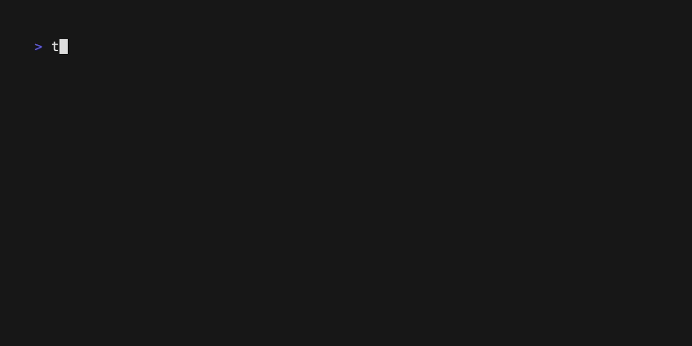

# 🖥️ ti — Telematik CLI

A command-line tool for interacting with the German Telematikinfrastruktur (TI) — specifically the Konnektor healthcare connector and PKCS#12 certificate files.



## Installation

```bash
go install github.com/gematik/zero-lab/go/ti@latest
```

## Configuration

Konnektor commands require a `.kon` configuration file (JSON):

```json
{
  "url": "https://konnektor.example.com",
  "mandantId": "m1",
  "workplaceId": "w1",
  "clientSystemId": "cs1",
  "credentials": {
    "type": "basic",
    "username": "${KON_USER}",
    "password": "${KON_PASS}"
  }
}
```

Environment variables can be referenced with `${VAR_NAME}` syntax.

Specify the config with `-k`/`--kon` flag or `DOTKON_FILE` env var. The name is resolved as:

1. Exact path
2. `<name>.kon` in current directory
3. `$XDG_CONFIG_HOME/telematik/kon/<name>.kon`

Default name is `default` (i.e. `default.kon`).

### Credential types

| Type | Fields | Description |
|------|--------|-------------|
| `basic` | `username`, `password` | HTTP Basic Auth |
| `pkcs12` | `data`, `password` | Base64-encoded PKCS#12 for mTLS |
| `system` | `name` | System keychain reference |

## Usage

### Konnektor commands

```bash
# Show Konnektor product information
ti kon get info

# List available SOAP services and endpoints
ti kon get services
ti kon get services --raw          # raw XML output

# List inserted cards (SMC-B, HBA, eGK, …)
ti kon get cards

# Show connector, card terminal, and card status
ti kon get status

# List certificates on a card
ti kon get certificates <card-handle>

# Show detailed certificate information
ti kon describe certificate <card-handle> <cert-ref>
# cert-ref: C.AUT, C.ENC, C.SIG, C.QES

# Verify a card PIN
ti kon verify pin <card-handle> <pin-type>
```

### PKCS#12 commands

```bash
# Inspect contents of a PKCS#12 file
ti pkcs12 inspect <file>

# Convert legacy BER-encoded PKCS#12 to modern DER format
ti pkcs12 convert <input> <output>

# Encode PKCS#12 file as .kon credentials JSON
ti pkcs12 encode <file>
```

### Global flags

| Flag | Description |
|------|-------------|
| `-v`, `--verbose` | Enable debug logging |
| `-k`, `--kon` | Name or path of `.kon` config file |
| `-o`, `--output` | Output format: `text` (default) or `json` |

## License

EUROPEAN UNION PUBLIC LICENCE v. 1.2 — see [LICENSE](../../LICENSE).
